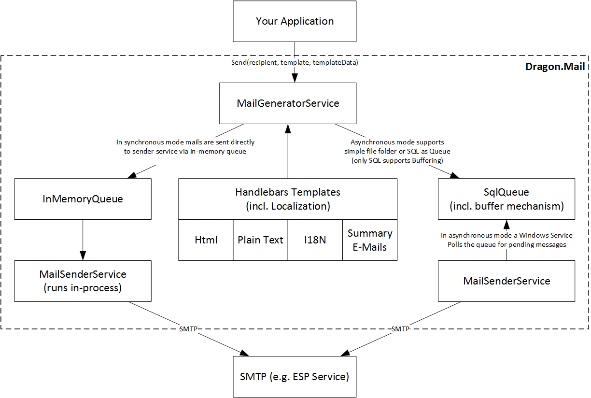

# Dragon.Mail

The Mail Templating and Sending Module (part of Dragon Web Framework) for .NET that supports 

- Handlebar Templates (HTML & plain-text), 
- Internationalization, 
- Summary E-Mails (Batching, i.e. do not send more than 1 email per X hours) and 
- Asynchronous Sending.

License: [MIT](https://opensource.org/licenses/MIT)

**Table of contents**
* [Architecture](#architecture)
* [Downloading](#downloading)
* [Basic Usage (Synchronous)](#basic-usage--synchronous-)
  + [Preparing the templates directory](#preparing-the-templates-directory)
  + [Application Configuration](#application-configuration)
  + [Basic e-mail sending](#basic-e-mail-sending)
* [Asynchronous sending and batching](#asynchronous-sending-and-batching)
  + [Extending templates for batching](#extending-templates-for-batching)
  + [Application configuration](#application-configuration)
  + [Database setup and configuration](#database-setup-and-configuration)
  + [Service setup](#service-setup)
  + [Application example](#application-example)
* [Advanced Use Cases, Extensions and Customization](#advanced-use-cases--extensions-and-customization)
* [Used By](#used-by)

## Architecture

## Downloading

Either build from source code using Visual Studio >= 2013 or find everything except the Windows Service (required only for async sending) in the current NuGet packages at:

http://www.nuget.org/packages/Dragon.Mail/

## Basic Usage (Synchronous)

Dragon.Mail works in two modes. In simple mode mails are generated and sent immediately. In asynchronous mode mails are stored in a queue and sent from a service worker.

### Loading templates

From Version 1.10 onwards there are two options for loading templates. The classic method of using a directory of templates (with subdirectories for language specific overrides) and a new Resource File (RESX) adapter.

#### Templates Directory Method

By default the system loads templates from a folder using the following format:
     \templates 
       \template1	   <-- one folder per template, 
                           folder name specifies template name
         \body.html    <-- the html template
         \body.txt     <-- the text template (optional)
         \subject.html <-- the subject of the email
      \template2 	   <-- and so on for a template named template2
        ...
        ...
      include.html     <-- On the top level you may have files
      include.txt          you include in the templates 

The template files are written in [Handlebars syntax](http://handlebarsjs.com/) with one extension for including files. To include files you can write

    <h1>Example E-Mail</h1>
    
<b>Title:</b>{{title}}

    
<a href="{{{link}}}">Link</a>

    @inc(..\include.html)

This will include the footer file found at the relative file folder position.

In order to add another language for the template, simply add a folder 

     \templates 
       \template1	   
         \body.html   
         \body.txt    
         \subject.html
         \de
           \body.html    <-- the html template in German
           \body.txt     <-- the text template (optional) in German
           \subject.txt  <-- the subject of the email in German
         \de-at
           \body.html    <-- the html template in Austrian German
           \body.txt     <-- etc
           \subject.txt  <-- etc
      \template2 	   
        ...
        ...
      include.html  
      include.txt   
      \de 
        include.html     <-- You need to reference these specifically 
        include.txt          from your template file. So use 
                             ..\..\de\include.html instead of
                             ..\include.html.

The next best matching template is used. So `de-at` will use the specific template specified here, where as both `de` and `de-ch` will use the `de` template.  If no language match can be found the default is used, so fr will use the root folder template.

#### Resource File Method

Create a resource file (e.g. Templates.resx) for your e-mail templates and add the corresponding language files (Templates.de-AT.resx).

For each template and in each template file* add the following keys to the file:

     templatename_subject_text	<-- 
     templatename_body_text		<-- the text template for e-mails
     templatename_body_html		<-- the html template for e-mails

You must specify at least one of the body tempaltes. If you specify the html a plain text rendering will be created automatically. If you specify the text template no html body will be available in e-mails. If you specify both the email will contain alternative views for both versions.

*If you only specify a key in the invariant culture resource file (Templates.resx) but no in the language specific version (Templates.de-AT.resx) the invariant culture template will be used.

### Application Configuration

By default the configuration is read from the application configuration file (app.config or web.config). You can implement the interface `Dragon.Mail.Interfaces.IConfiguration` and provide the configuration values directly (using the same key values as below). 

    <appSettings>
      <!-- E-mail address and name of the sender to use  -->
      <add key="Dragon.Mail.Sender.Address" value="sam@example.org" />
      <add key="Dragon.Mail.Sender.Name" value="Sam Sender" />
    
      <!-- Path to the templates directory (only required if you are loading your templates from a folder)  -->
      <add key="Dragon.Mail.Templates.Folder" value="..\templates" />
    
      <!-- The language to register the root folder templates with -->
      <add key="Dragon.Mail.Templates.DefaultLanguage" value="en-us" />
    </appSettings>

### Basic e-mail sending

Add the `Dragon.Mail.Impl` namespace. The following code shows the basic setup. 

The `MailGeneratorService` has optional parameters for all parts of the mail generation and sending pipeline if you wish to customize any of it. See further below for examples. The templates are loaded from the file system and passed to the service.

    // Create the main generator service
    var generatorService = new MailGeneratorService();
    
    // Use template helper to load templates from folder 
    // and add to generator service
    var templateFolder = new FileFolderTemplateRepository();
    templateFolder.EnumerateTemplates(generatorService.Register);

After the service is setup you can send an email providing the recipient, the template name (folder name) and optionally data for the template to use.

    generatorService.Send(
      /* the recipient, email is required, fullname is optional */
      new { email = "test@example.org" },
      /* the name of the folder to take the template files from */
      "template1",
      /* data passed to the template for e-mail generation      */
      new { title = "Example", link = "http://www.google.com" }
    );

If you want to send a different language, you can pass in the corresponding `CultureInfo` object.

    generatorService.Send(
      new { email = "test@example.org" },
      "template1",
      new { title = "Example", link = "http://www.google.com" },
      /* pass a specific culture to use the template in that language */
      /* if no template for that culture exists, it will fall back to */
      /* the default culture specific in application configuration    */
      CultureInfo.GetCultureInfo("de")
    );

## Asynchronous sending and batching

Dragon.Mail can be configured to store mails in a queue and send them asynchronously. This is faster when sending emails (because the application does not have to wait for the SMTP processing), but requires extra infrastructure (a Windows Service for the actual sending).

Two queue types are supported out of the box. A file folder queue and a SQL Server based queue.

The latter has the additional benefit is that this use case supports email batching. You can specify how many emails a user should receive in a specified number of hours. The first email is sent straight away and the next emails are batched until the specified number of hours are passed and sent as one summary email.

This requires more setup which we will look at. For simple asynchronous sending simply set up the service and specify one of the queues.

### Extending templates for batching

In order to support e-mail batching the template are extended to include parts for the summary emails.

In addition to the existing templates, add four templates for html summary emails and optionally four templates for text emails.

     \templates 
       \template1	   
         \summarysubject.html   <-- subject for summary emails
         \summaryheader.html    <-- inserted at the top of summary email
         \summarybody.html      <-- like body.html but usually shorter
                                    and repeated for each mail added to
                                    the summary email
         \summaryfooter.html    <-- inserted at the bottom
    
         \summarysubject.txt    <-- the same templates 
         \summaryheader.txt         but in plain text format
         \summarybody.txt
         \summaryfooter.txt

### Application configuration

The application (the system generating the email) configuration must be extended as follows:

    <appSettings>
      <!-- Add this key to switch on async mode -->
      <add key="Dragon.Mail.AsyncActive" value="true" />
    
      <!-- If you use FileFolderMailQueue specify the folder -->
      <add key="Dragon.Mail.FileFolderMailQueue.Folder" 
           value="c:\temp\dragonmail" />
      
      <!-- If you use SqlMailQueue specify the table -->
      <add key="Dragon.Mail.Queue.Sql.Table" value="Mail" />
    
    </appSettings>

### Database setup and configuration

If you are using SqlMailQueue you must also specify a connection string with key "Dragon" pointing to the database that includes the specified SQL table.

Create the table using the following script:

    CREATE TABLE [dbo].[Mail](
    	[MailID] [uniqueidentifier] NOT NULL,
    	[Sent] [bit] NOT NULL,
    	[Error] [bit] NOT NULL,
    	[SenderDisplayName] [nvarchar](400) NULL,
    	[SenderEmailAddress] [nvarchar](400) NULL,
    	[ReceiverDisplayName] [nvarchar](400) NULL,
    	[ReceiverEmailAddress] [nvarchar](400) NULL,
    	[Subject] [nvarchar](400) NULL,
    	[Body] [nvarchar](max) NULL,
    	[TextBody] [nvarchar](max) NULL,
    	[SummarySubject] [nvarchar](400) NULL,
    	[SummaryHeader] [nvarchar](max) NULL,
    	[SummaryBody] [nvarchar](max) NULL,
    	[SummaryFooter] [nvarchar](max) NULL,
    	[SummaryTextHeader] [nvarchar](max) NULL,
    	[SummaryTextBody] [nvarchar](max) NULL,
    	[SummaryTextFooter] [nvarchar](max) NULL,
    	[EnqueueUTC] [datetime] NULL,
    	[NextProcessingAttemptUTC] [datetime] NOT NULL,
    	[LastProcessedUTC] [datetime] NULL,
    	[SentUTC] [datetime] NULL,
    	[UserID] [nvarchar](400) NULL,
    	[BufferHours] [int] NOT NULL,
    	[BufferIgnored] [bit] NOT NULL,
    	[BufferFlush] [bit] NOT NULL,
        CONSTRAINT [PK_Mail] PRIMARY KEY CLUSTERED ( [MailID] ASC )
    )

### Service setup

We recommend using [TopShelf project](http://topshelf-project.com/) for creating the Windows Service, but you can integrate the MailSenderService in any Windows Service (or Console application for that matter). 

Using TopShelf you can set up the service as follows:

    HostFactory.Run(x =>
    {
        x.Service<MailSenderService>(s =>
        {
            s.ConstructUsing(name => 
                new MailSenderService(new SqlMailQueue()));
                // or
                // new MailSenderService(new FileFolderMailQueue()));
            s.WhenStarted(tc => tc.Start());
            s.WhenStopped(tc => tc.Stop());
        });
        x.RunAsLocalSystem();
    
        x.SetDescription("Sends mail for Dragon.Mail");
        x.SetDisplayName("Dragon Mail Service");
        x.SetServiceName("Dragon.Mail.Service");
    });

### Application example

Sending to the async queue is done the same as for synchronous sending, but you specify extra parameters for the user.

    generatorService.Send(
        new
        {
            email = "test@example.org",
            userid = "unique-identifier-for-user-1",
            bufferHours = 4,
            ignoreBuffer = false,
            flushBuffer = false
        },
        "template1",
        new { title = "Example", link = "http://www.google.com" },
        CultureInfo.GetCultureInfo("de"));

The parameters are:

- userid (required): a unique string identifying the user (batching is performed per unique userid)
- bufferHours (required): the number of hours to wait before sending an email since the last one sent (the first one goes out immediately). 
- ignoreBuffer (optional): set to true if this email should be sent out immediately without applying any buffer rules (useful for e.g. "Reset Password Emails").
- flushBuffer (optional): set to true will cause the queue to be flushed for that user immediately.

The values of the last email sent to the queue will be used. So if you want to change the buffer value for a user, simply set it to the new value on the next email and it will be considered immediately.

## Advanced Use Cases, Extensions and Customization

### Logging

The DefaultSmtpClient has a logging parameter you can pass to do your own logging of outgoing messages. Example:

      var smtpClient = new DefaultSmtpClient((MailMessage mm )=> { /* Do logging */ });
      m_mailSenderService = new MailSenderService(queue, smtpClient: smtpClient);
      
### Extending Dragon.Mail

Almost every part of Dragon.Mail is open to customizing. This is best exemplified by the constructor overloads for `MailGeneratorService`.

    public MailGeneratorService(
                IMailQueue queue = null,
                IDataStore dataStore = null,
                Func<Template, IRenderer> rendererFactory = null,
                IDataDecorator[] decorators = null,
                IReceiverMapper receiverMapper = null,
                ISenderConfiguration senderConfiguration = null,
                IConfiguration configuration = null,
                IHttpClient httpClient = null,
                IMailSenderService mailSenderService = null,
                bool? async = null)

**IMailQueue**

The queue's responsibility is to enqueue and dequeue mails. 

**IDataStore and IDataDecorator**

The data elements (receiver and data) are passed through decorators before handing over to the Handlebars renderer. By default there is a RestResolvingDecorator which allows you to supply an Uri to the receiver or data parameters when sending emails and it will fetch and store the JSON document at that url in that field. If an IDataStore is provided this value will be cached (otherwise it will fetch the data for each email sent). It is wise to use a URL that has the timestamp or versioning parameter included in the URL.

    generatorService.Send(
        new Uri("http://example.org/api/v1/users/123?v=201604051200"),
        "template1",
        new {
            title = "Example",
            link = "http://www.google.com",
            order = new Uri("http://example.org/api/v1/orders/17?v=201608091454")
        },
        CultureInfo.GetCultureInfo("de"));

**IRenderer**

You can implement a different rendering engine for all or some of the templates by implementing IRenderer and passing it in.

**IReceiverMapper**

By default the email is the only required field and mapped to the the receiver's email address. If you want to use a different property or mapping implement this interface.

**ISenderConfiguration**

By default the value for the sending email address are read from the application configuration via `IConfiguration`. Implement this interface to change that behaviour.

**IConfiguration**

By default all configuration is read from the application configuration. To change this behaviour and load the configuration from another source implement this interface.

**IHttpClient**

The RestResolvingDecorator uses this interface to get the data.

**IMailSenderService**

If you want to simply use the template generation part you can override the sending behaviour by passing in another implementation of this interface.

## Used By

- [WhatAVenture Innovation Platform](http://www.whataventure.com)
- [FoundersExperts](http://foundersexperts.com)
- [DualConsult](http://dualconsult.com)
- [EasySlides](http://www.easyslides.co)
- [Austrian Energy Agency](http://www.monitoringstelle.at)
